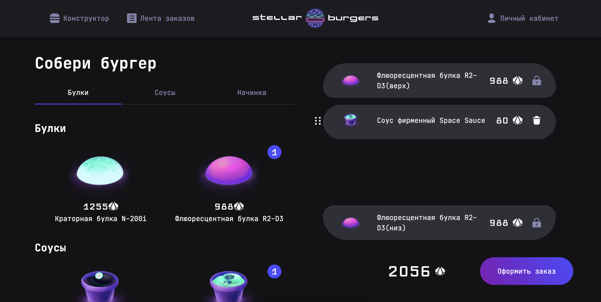

<h1 align="center">
    
</h1>

# react-sneakers
## [Учебный проект](http://portfolio.nikitpkn.beget.tech/) на курсе React разработчик от [Яндекс Практикум](https://practicum.yandex.ru/react/)
## Ссылка на проект в gh-pages: **[react-sneakers](https://norv139.github.io/react-burger/)**

## Описание:
  
  Web-приложение для ресторана Stellar Burgers

## Стэк:
- Интерфейс: `React`, [ya.praktikum](https://yandex-praktikum.github.io/react-developer-burger-ui-components/docs/)
- Управление данными: `Redux` 
- ЯП: `TypeScript`
- Тестирование: `cypress`, `jest`

## Задачи:
  Нету

## Тестирование

##### `npm install` – установить зависимости проекта

##### `npm run cypress open` – запуск визуального тестирования

##### `npm run test` - для запуска тестирования redux

## Установка:

##### `npm install` – установить зависимости проекта

##### `npm start` – запуск devServer на http://localhost:3000/

##### `npm build` – production сборка проекта
